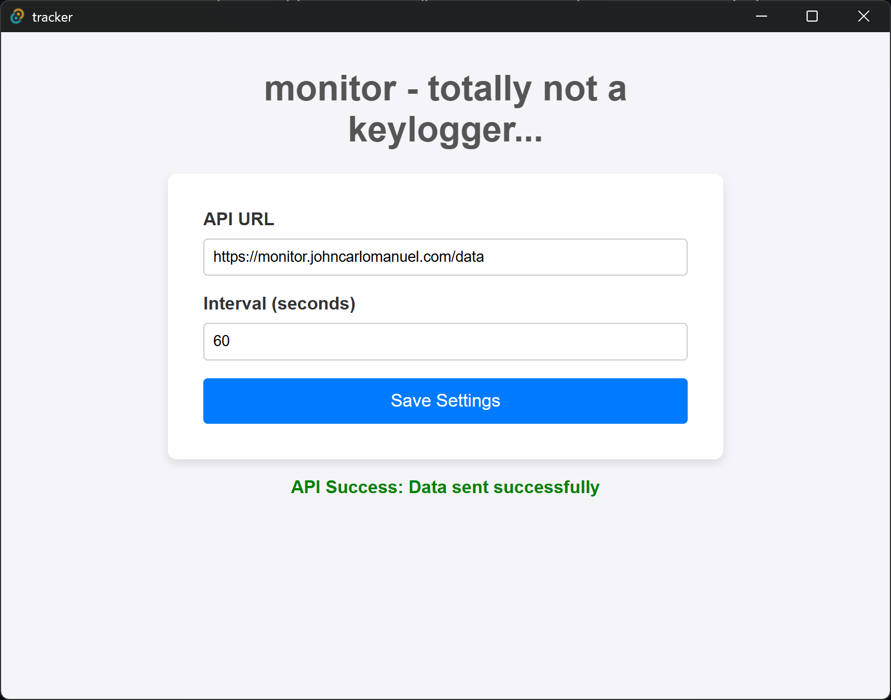

# monitor

keyboard and mouse monitor... in rust! basically a keylogger only for personal use. this sends a number of keypresses and mouse clicks to a server, which my personal website (johncarlomanuel.com) will consume and display on the front page. 



todo: add a video demo

## Set up

### Prerequisites

Install:
1. Deno
2. Rust

### Tauri application

```
cd ./tracker
deno install 
```

then you'll want to set up an api key to authenticate with the server so only authorized computers can send their data to the api.

create api key using `/utils/keygen.ts` (at root) with `deno task keygen`

then use the generated api key and paste it in `/tracker/src-tauri/.env` (create if haven't already)

```
API_KEY="your key here"
```

for production, create `.env.production` in the same directory with same format and generate another api key to use using `deno task keygen`

after that, run `deno task tauri dev` to view the application in dev mode. for production use `deno task tauri build`

### Deno API

in `/api`, create `.env` following `.env.example` and paste in the same api key from `/tracker/src-tauri/.env`

for production, make sure it matches the one in `/tracker/src-tauri/.env.production`

run `deno task dev` to run the server. 
for production use `deno task start`
